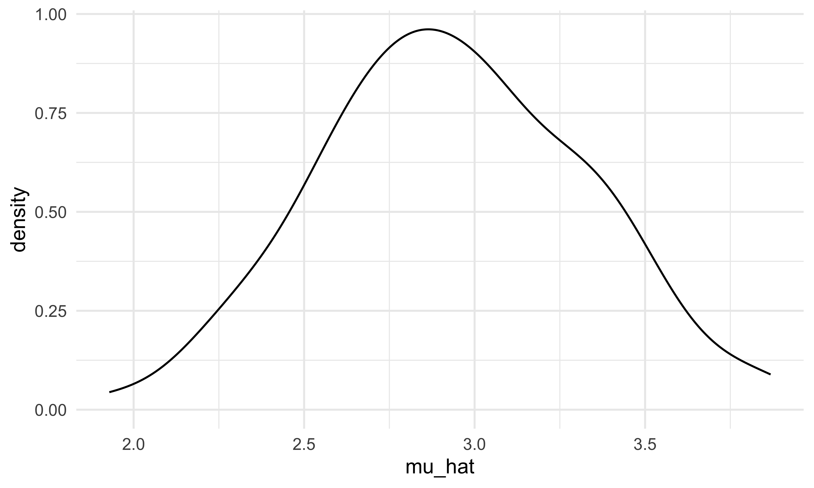
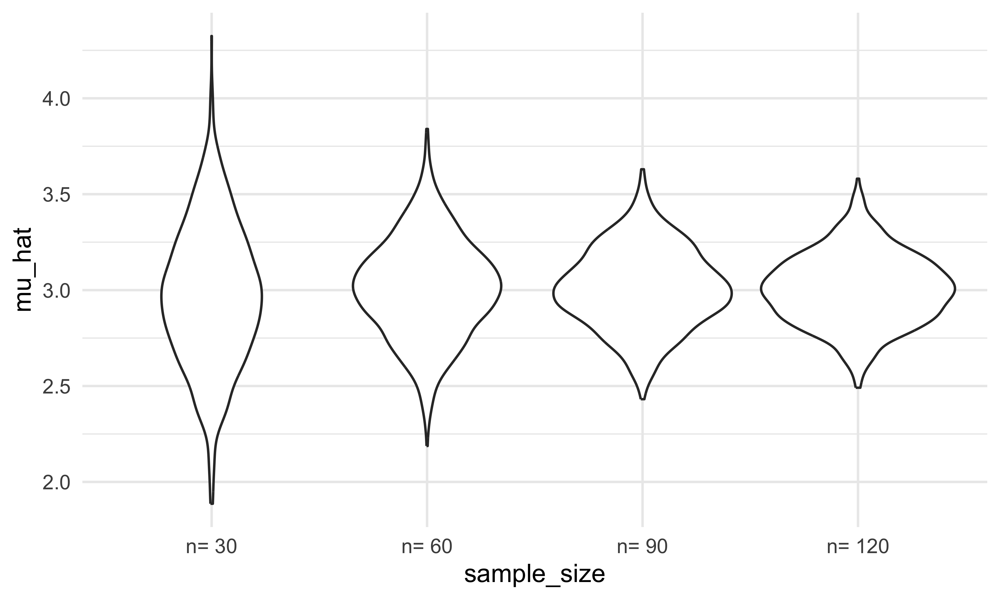
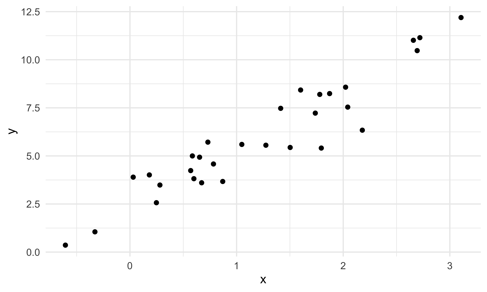
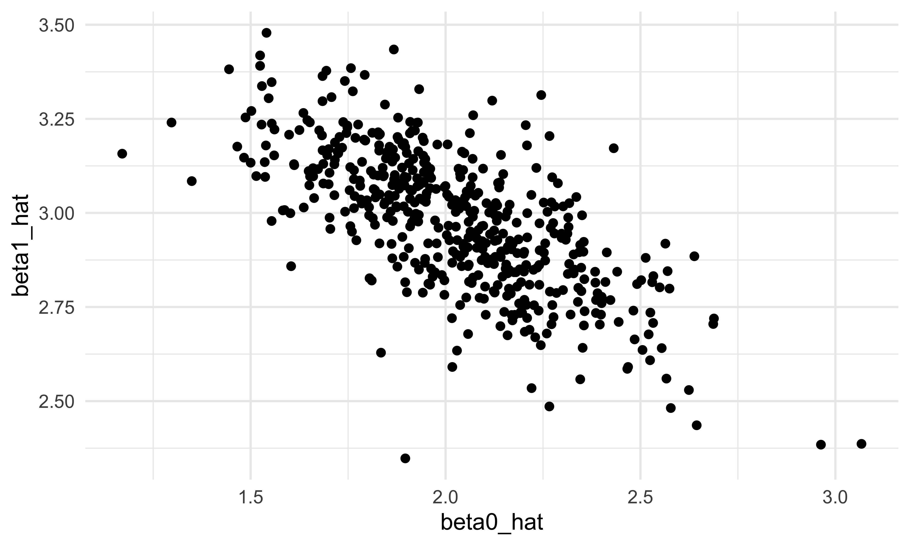
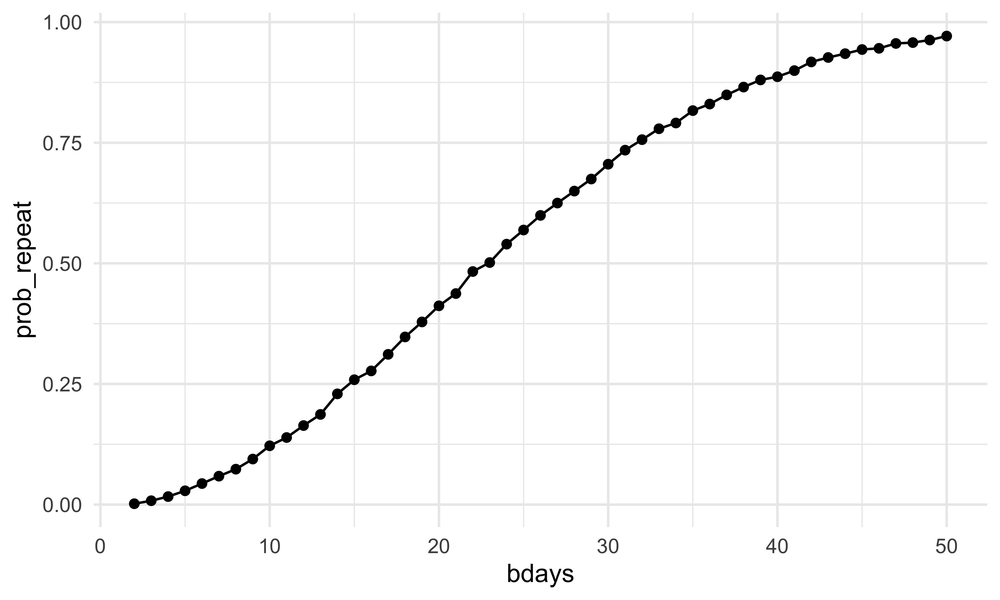

Simulation
================
Bohan Zhu
2025-11-11

Load key packages and source necessary files

``` r
library(tidyverse)
```

    ## ── Attaching core tidyverse packages ──────────────────────── tidyverse 2.0.0 ──
    ## ✔ dplyr     1.1.4     ✔ readr     2.1.5
    ## ✔ forcats   1.0.0     ✔ stringr   1.5.1
    ## ✔ ggplot2   4.0.0     ✔ tibble    3.3.0
    ## ✔ lubridate 1.9.4     ✔ tidyr     1.3.1
    ## ✔ purrr     1.1.0     
    ## ── Conflicts ────────────────────────────────────────── tidyverse_conflicts() ──
    ## ✖ dplyr::filter() masks stats::filter()
    ## ✖ dplyr::lag()    masks stats::lag()
    ## ℹ Use the conflicted package (<http://conflicted.r-lib.org/>) to force all conflicts to become errors

``` r
source("sim_mean_sd.R")
```

We can “simulate” by running our function

``` r
sim_mean_sd(n_subj = 400)
```

    ## # A tibble: 1 × 2
    ##   mu_hat sigma_hat
    ##    <dbl>     <dbl>
    ## 1   2.95      2.05

can I “verify” the central limit theorem?

``` r
output = vector("list", length = 100)

for (i in 1:100){
  output[[i]] = sim_mean_sd(30)
}

output |> 
  bind_rows() |> 
  ggplot(aes(x = mu_hat)) +
  geom_density()
```



Try to repeat with a map statement

``` r
sim_results_df =
  expand_grid(
    iter = 1:1000,
    sample_size = c(30, 60, 90, 120)
  ) |> 
  mutate(
    results = map(sample_size, sim_mean_sd)
  ) |> 
  unnest(results)
```

Let’s look at this:

``` r
sim_results_df |> 
  mutate(
    sample_size = str_c("n= ", sample_size),
    sample_size = fct_inorder(sample_size)
    ) |> 
  ggplot(aes(x = sample_size, y = mu_hat)) +
  geom_violin()
```



Let’s try to summarize ..

``` r
sim_results_df |> 
  group_by(sample_size) |> 
  summarize(
    emp_mean = mean(mu_hat),
    emp_se = sd(mu_hat)
  )
```

    ## # A tibble: 4 × 3
    ##   sample_size emp_mean emp_se
    ##         <dbl>    <dbl>  <dbl>
    ## 1          30     2.97  0.366
    ## 2          60     3.01  0.258
    ## 3          90     3.01  0.208
    ## 4         120     3.00  0.184

## Simple linear regression

``` r
sim_df =
  tibble(
    x = rnorm(30, mean = 1, sd = 1),
    y = 2 + 3*x + rnorm(30,0,1)
  )

sim_df |> 
  ggplot(aes(x = x, y = y)) +
  geom_point()
```



``` r
slr_fit = lm(y ~ x, data = sim_df)

coef(slr_fit)
```

    ## (Intercept)           x 
    ##    2.472672    2.876160

turn this into a function

``` r
sim_regression = function (n_subj, beta_0 = 2, beta_1 = 3 ){
  sim_df = 
  tibble(
    x = rnorm(n_subj, mean = 1, sd = 1),
    y = beta_0 + beta_1*x + rnorm(n_subj,0,1)
  )
  
  slr_fit = lm(y ~ x, data = sim_df)
  
  tibble(
    beta0_hat = coef(slr_fit)[1],
    beta1_hat = coef(slr_fit)[2]
    )
}
```

``` r
sim_regression(n_subj = 30)
```

    ## # A tibble: 1 × 2
    ##   beta0_hat beta1_hat
    ##       <dbl>     <dbl>
    ## 1      2.12      2.84

``` r
output = vector("list", length = 500)

for (i in 1:500){
  
  output[[i]] = sim_regression(n_subj = 30)
  
}

output |> 
  bind_rows()
```

    ## # A tibble: 500 × 2
    ##    beta0_hat beta1_hat
    ##        <dbl>     <dbl>
    ##  1      1.75      3.15
    ##  2      2.01      2.87
    ##  3      1.92      3.19
    ##  4      2.48      2.89
    ##  5      2.07      3.16
    ##  6      1.67      3.20
    ##  7      2.21      2.84
    ##  8      2.20      2.78
    ##  9      1.82      2.96
    ## 10      2.11      2.77
    ## # ℹ 490 more rows

``` r
slr_sim_results_df = 
  expand_grid(
    sample_size = 30, 
    iter = 1:500
  ) |> 
  mutate(
    results = map(sample_size, sim_regression)
  ) |> 
  unnest(results)

slr_sim_results_df |> 
  ggplot(aes(x = beta0_hat, y = beta1_hat)) + 
  geom_point()
```



## One more example!

Inner part

``` r
birthdays = sample(1:365, 5, replace = TRUE)

repeated_bday = length(unique(birthdays)) < 5 # if repeat, TRUE. No repeat,FALSE.
repeated_bday
```

Put this into a function

``` r
bday_sim = function(n_room){
  
  birthdays = sample(1:365, n_room, replace = TRUE)
  
  repeated_bday = length(unique(birthdays)) < n_room 
  
  repeated_bday

}
```

``` r
bday_sim(20)
```

``` r
bday_sim_results = 
  expand_grid(
    bdays = 2:50,
    iter = 1:10000
  ) |> 
  mutate(
    result = map_lgl(bdays, bday_sim)
  ) |> 
  group_by(
    bdays
  ) |> 
  summarize(
    prob_repeat = mean(result)
  )
```

plot this

``` r
bday_sim_results |> 
  ggplot(aes(x = bdays, y = prob_repeat)) +
  geom_point() +
  geom_line()
```


